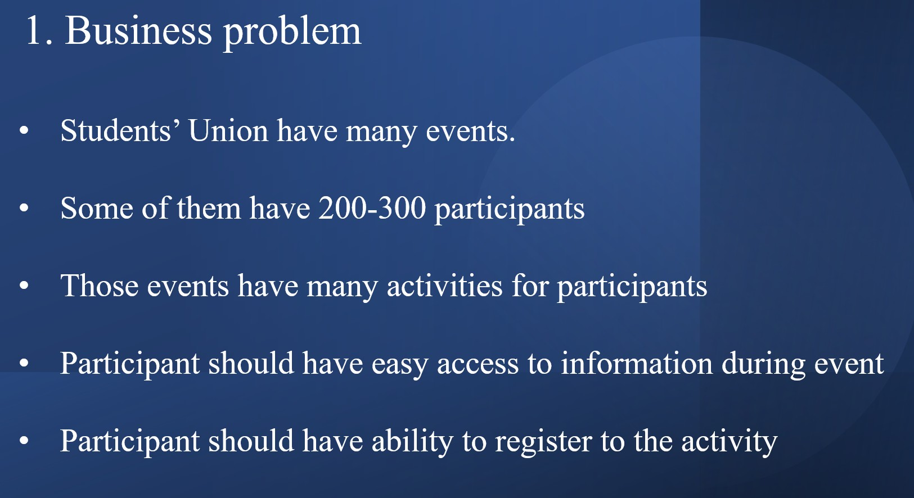
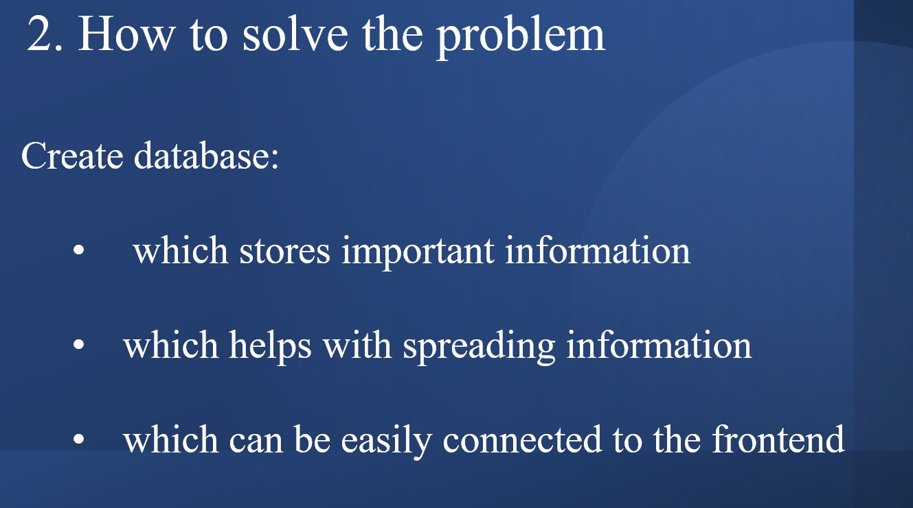
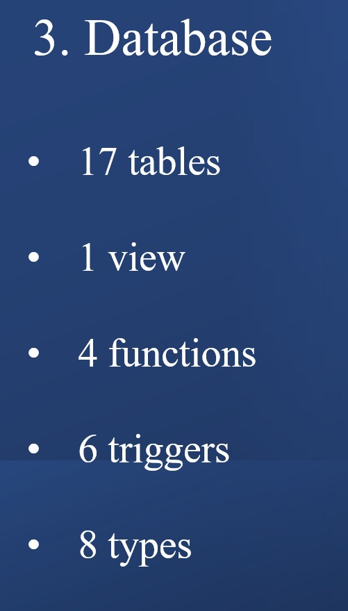
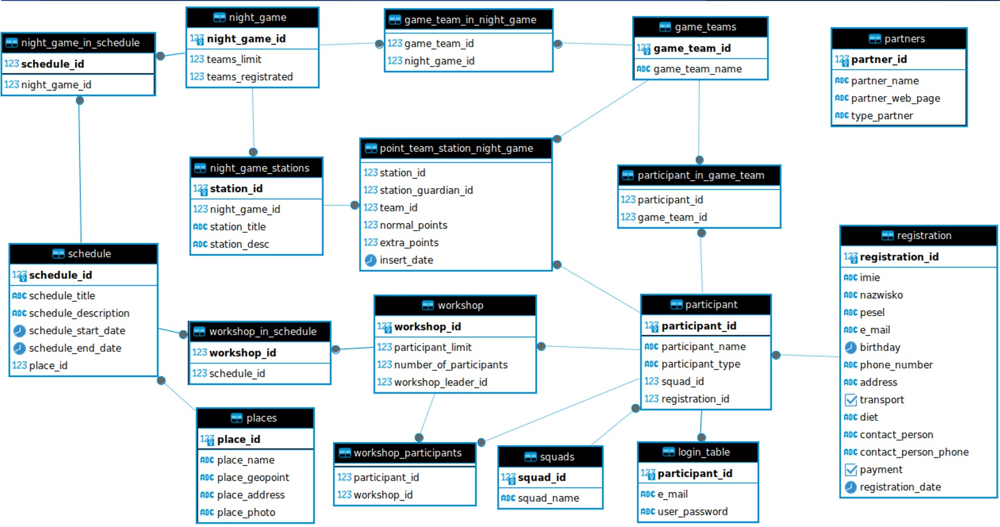

# SQL_NoSQL_tasks

W tym repozytorium znajduje się bardzo mała część zadań, które robiłem podczas studiów magisterskich. Niestety część przepadła wraz ze zmianą laptopa.
Dlatego też jest tylko jeden plik z NoSQL,

W folderze SQL znajdują się 3 pliki z czego 2 są z laboratoriów a jeden to mój projekt zaliczeniowy. Projekt miał na celu zdefiniowanie jakiegoś problemu oraz sposób rozwiązania go za pomocą bazy danych.
Ja za swój problem wybrałem wydarzenia studenckie na Politechnice i aplikacje z tym związaną ponieważ miałem w tym jakieś doświadczenie. Poniżej wycinek prezentacji.  
 

Następnie przedstawienie możliwego rozwiązania problemu: 

Specyfikacja wymyślonej przeze mnie bazy danych: 

Takie rozwiązanie stowrzyło bardzo dużą bazę danych która celowała by rozwiązać każdy możliwy problem który może wystąpić związany z tworzeniem wydarzenia.
Pewnie lepiej byłby rozdzielić to na mniejsze bazy ale brak mi w tym takiego doświadczenia. Oczywiście ACID został zastosowany.
